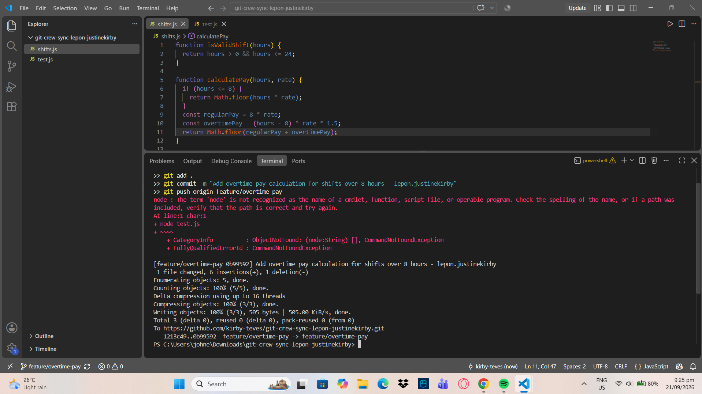
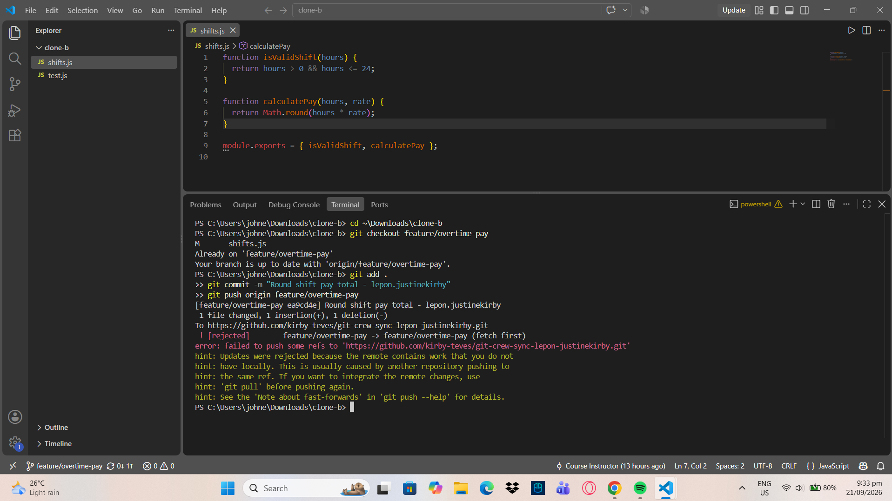
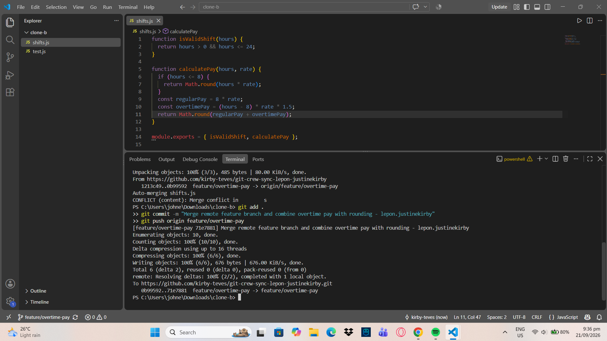
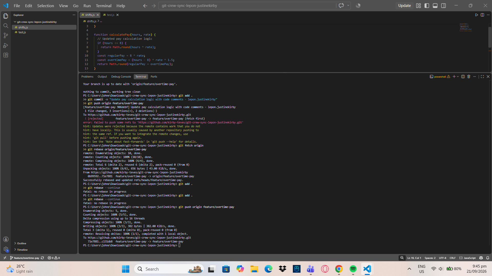
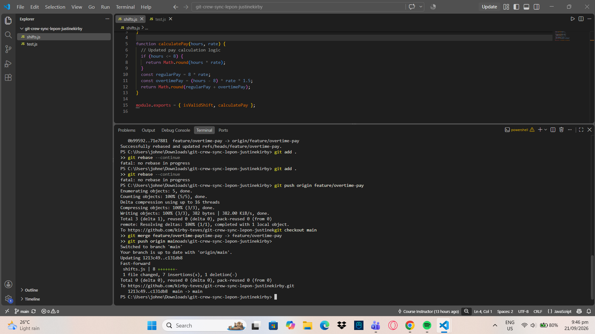
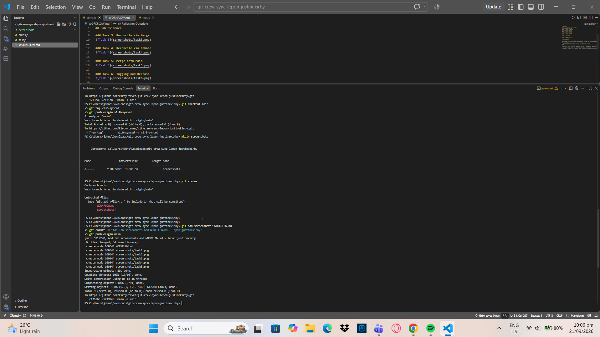

## Lab Evidence

### Task 1: Overtime Calculation & Initial Push

### Task 2: Divergent Push Rejected

### Task 3: Reconcile via Merge

### Task 4: Reconcile via Rebase

### Task 5: Merge into Main

### Task 6: Tagging and Release

## Reflection Questions

1. What did the rejected push error message tell you, and why did it happen?
The error message (! [rejected]) indicated that your push was blocked because the remote branch contained updates that you did not have locally. It happened because another clone/teammate pushed new commits to the same branch after you last fetched, causing your local history to diverge.

2. What's the actual difference between how you resolved Task 3 (merge) vs Task 4 (rebase)?
In Task 3, git merge joined the divergent histories by creating a dedicated merge commit, preserving the non-linear timeline. In Task 4, git rebase placed your local commit on top of the remote changes, creating a clean, linear history without an extra merge commit. 

3. What one habit would have avoided both rejected pushes in this lab?
Always running git pull (or fetching remote updates) before making edits or attempting to push code. This ensures your local workspace is synchronized with the latest remote state before adding new work.   

4. Which approach – merge or rebase – would you default to on a shared team branch, and why?
I would default to git merge on a shared team branch. Rebasing rewrites commit history, which can break tracking and cause severe synchronization errors for other collaborators who have already pulled those commits.